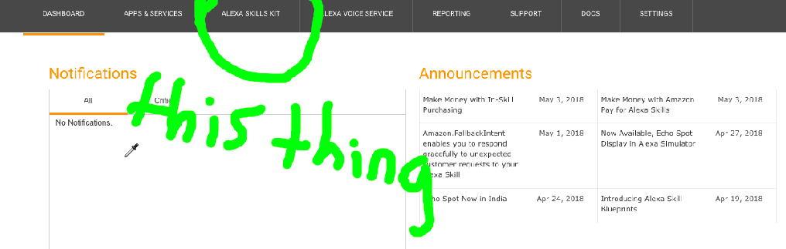

# alexa-skill-starter-kit
This project helps you develop a simple skill for the Amazon Alexa in `Python 2.7`. This simply provides a framework for the development and can be easily adapted for your usage. The text below describes how to use this to create a skill from start to finish.

___

## Creating an Alexa Skill
For our example skill, we are going to be building a really simple Alexa skill which can generate a random Haiku using a set list of phrases. This will be achieved using [Amazon Developer](https://developer.amazon.com) and [Amazon Lambda](https://console.aws.amazon.com/lambda/). It also helps quite a bit to have an Alexa of your own to test out the skill.

- [Amazon Developer](https://developer.amazon.com) is Amazon's developer website, giving developers abilities to create things such as Amazon Apps, desktop applications and of course, Alexa Skills.

- [Amazon Lambda](https://console.aws.amazon.com/lambda/) is a service provided by Amazon which allows people to run code in the cloud, without having to mess about with servers. What's more, it's been built with Amazon Alexa in mind, providing it with some useful testing features.

### Overview
Here's a brief overview of the steps needed to create a functioning Alexa Skill:
0. Thinking and planning the Alexa Skill. [↵](#0-thinking-and-planning)
1. Creating a new Alexa Skill on [Amazon Developer Alexa](https://developer.amazon.com/alexa). [↵](#1-creating-the-alexa-skill-on-amazon-developer-alexa)
2. Adding an [invocation name](https://developer.amazon.com/docs/custom-skills/choose-the-invocation-name-for-a-custom-skill.html), [intents](https://developer.amazon.com/docs/custom-skills/create-intents-utterances-and-slots.html) and [sample utterances](https://developer.amazon.com/docs/custom-skills/create-intents-utterances-and-slots.html). [↵](#1-invocation-intents-and-sample-utterances)
3. Setting up a Python lambda function on [Amazon Lambda](https://console.aws.amazon.com/lambda/). [↵]()
4. Linking the Alexa Skill to the Amazon Lambda function. [↵]()
5. Programming the Alexa Skill. [↵]()
6. Testing the Alexa skill first by using the [Amazon Lambda](https://console.aws.amazon.com/lambda/). [↵]()
7. Customising how the Alexa skill will look inside the Alexa app. [↵]()
8. Beta Testing - Allowing a few users (or just you) to test the Alexa skill using a real Alexa skill. [↵]()
9. Submitting for certification, and hopefully receiving the message that it's passed and is now live on the Alexa Skill store. [↵]()

How hard can it be?

### 0. Thinking and planning.
As I previously mentioned, for this I will building an example Alexa skill which generates Haikus using a previously written structure. I now need to think about how I would ask Alexa to get such a thing.

    Alexa, ask Haiku Generator to generate a haiku.
    Alexa, tell Haiku Generator I want a haiku.
    Alexa, tell Haiku Generator to haiku me up.

Well, possibly not the last one.

One thing that you need to keep in mind when thinking of these example phrases is the format of how you ask the question. At the moment, and probably forever, Alexa only allows you to create skills that follow the following format:

    Alexa, ask/tell... [Skill Name] to [perform action]

This makes sense because if Alexa allowed phrases to be available to any skill, a skill that got updates about the weather using a phrase like

    Alexa, get the latest updates.

would be indistinguishable from a skill that got the latest news updates using the same phrase. Although this provides some limitation, it's still reasonably easy to create any functionality you need, the user might just have to ask for it in a funny way.

I would advise writing these example phrases down somewhere, so we can reference them in [step 2]().

### 1. Creating the Alexa Skill on [Amazon Developer Alexa](https://developer.amazon.com/alexa)
#### Creating an account
If you already have an Amazon Developer account, just [skip to the second part](#creating-the-skill).
The account creation system is pretty straightforward, and if you can program in Python, then you most likely know how to set up an account. However, here are the steps:

1. First, we need to go to [https://developer.amazon.com/](https://developer.amazon.com/). When you get there, a page that looks like this should appear:  

2. Next, we click on "Sign In" on the top bar. If you have a smaller screen, it might be located in the "hamburger" (yes, that's a technical term) on the left.   

3. Clicking this should bring us to a page that looks like this  

4. Click on the grey "Create your Amazon Developer account" beneath the golden "Sign In" button. That brings you to this page:  

5. Fill in your details and then go ahead and click on the "Create your Amazon Developer account", which is now gold. That will bring you to another page where you have to fill in yet more information.  

6. Fill in all the required information (marked by a \*/star symbol), and then hit the "Save and Continue" button on the bottom right.

7. It will then come up with a user agreement, which you should thoroughly read and annotate (I'm joking, don't do that). Just scroll to the bottom and hit "Accept and Continue".

8. It will then come up with a page asking about payment information. Tick both of the boxes "no" and press the "Save and Continue" button, unless you do plan to do either of those things. If you do tick "yes", you're on your own from here.  

9. We've finally set up our account. We should've arrived at a page that looks like this:  

#### Creating the skill
Now we've set up our account, we need to actually create the skill. Remember the page from above ([https://developer.amazon.com/home.html](https://developer.amazon.com/home.html)):  

1. Well, now we need to click on "ALEXA SKILLS KIT" on the second to top grey bar:  

2. This should bring us to another page. On this page, we need to click "Create Skill", a blue button roughly halfway down the page:

  

3. Now this page should appear:

  

4. **Important:** Now you need to type in your skill's name. At this stage, what you type won't affect what it will be called by Alexa, but structure and consistency is important. I'm going to call it "Haiku Generator"  

5. Then, you have to click the blue "Next" button. This comes up with yet another page, which looks like so:  

6. For our Alexa skill, we need to select the option that says "Custom". This can be done by clicking the "Select" button underneath "Custom" (labelled **1**):  

7. We now click "Create Skill" in the upper-right hand corner, labelled on the diagram as **2**, and we are ready to proceed to the next step.

In case you're interested these are what functions the different skill types have:

> Custom: Allows you to design a custom skill, without any pre-built features (what we're doing). Example: Haiku Generator, Pizza Topping generator.

> Flash Briefing: Allows you to create a skill that can function as part of a news feed or a feed of information. Example: News Reader, Popular Tweets reader.

> Smart Home: Allows you to create a skill that can change things in your home. Don't get excited, you need special equipment to do so.

> Video: Provides a framework for getting video content.

### 2. Invocation, intents and sample utterances
Remember [Step 0](#0-thinking-and-planning)? Well we're going to need to use the information you thought of now. In this step, we create an invocation name, an intent and some sample utterances.

Here are the definitions:
- **Invocation Name**: The invocation name is what the user says to activate the skill. For example *"Alexa, ask* **invocation name** *to..."*
- **Intent**: An intent is an action that somebody using the skill can ask for. For example, the intent of our Alexa skill (the Haiku Generator) is to generate Haikus. For example *Alexa, ask Haiku Generator to* **generate a haiku** *.*"
- **Sample Utterances**: The sample utterances are what a user might say to trigger a defined intent. For example, *Alexa, ask Haiku Generator to generate a haiku.* is what a user might say when they want to generate a Haiku. You should've already thought of these in [Step 0](#0-thinking-and-planning). 
